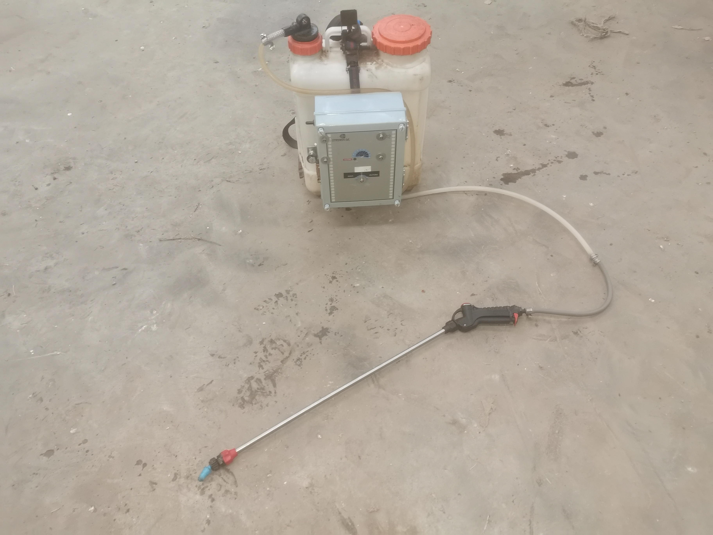
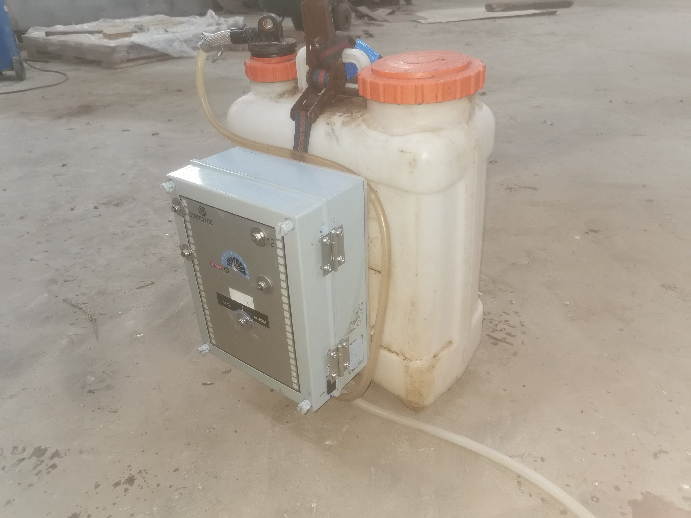
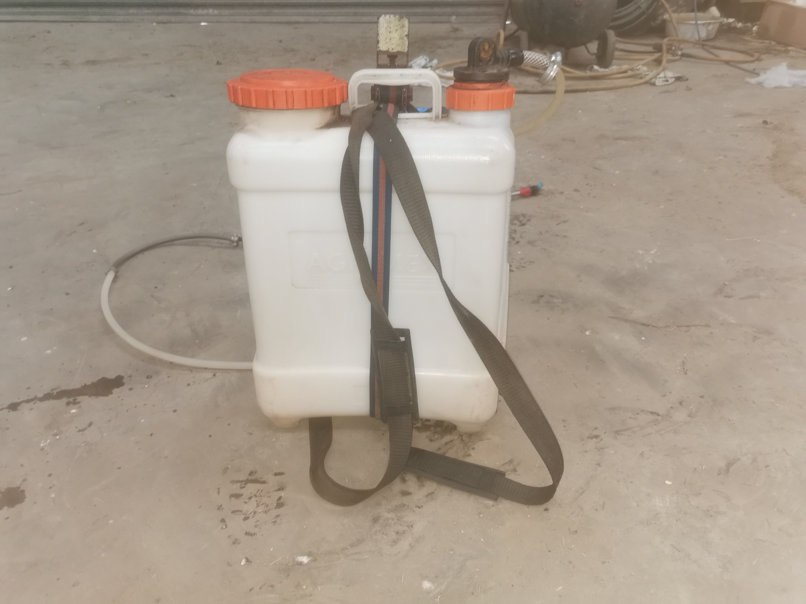
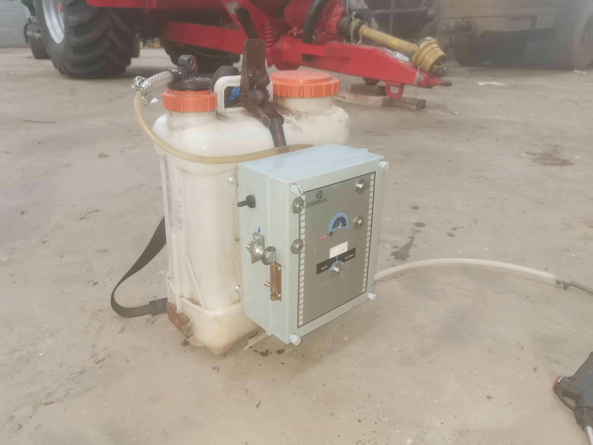

# Cordless-Back-Sprayer
A manually pumped back sprayer converted to automatic pumping, powered by a tool battery.

## How it works
A Milwaukee M18 5AH tool battery is pushed into a steel mount, with a connector leading 18VDC to a step down buck converter
which supplies 14VDC to a water pump. Flexible tubing runs from the pump's inlet to the tank, with the
lance connected to the outlet.

All components are fitted inside a plastic box, with hinges and a latch. A waterproof switch is also fitted
through the side of the box. Two lengths of flat bar aluminium with standoffs are bolted on the back of the box,
with a ratchet strap fixing the box to the sprayer.
